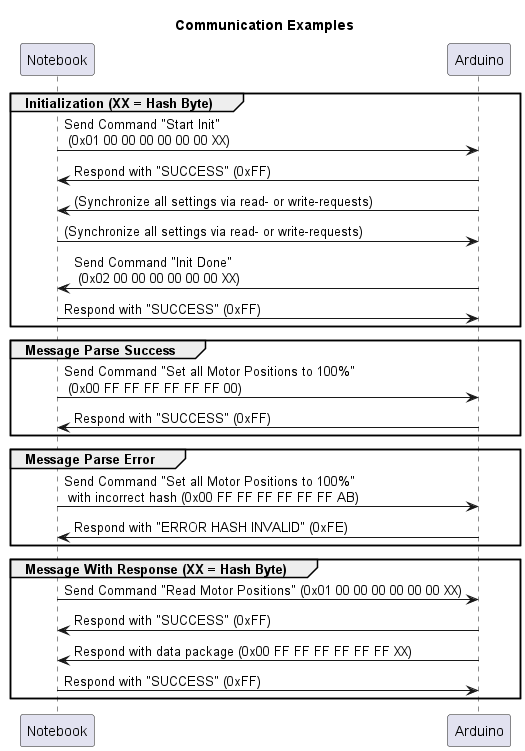

# Setup of Development environment
## Backend
The backend is located in the ``backend`` folder of the repository. To start the project, just open the .sln file and run the "speedseat"-Project. No further configuration required, provided you have the correct dotnet-version installed

## Frontend
The frontend code is located in the ``frontend``-folder of the repository. To start the project, a recent version of [Node.js](https://nodejs.org/en/download) needs to be installed on your system. To run the project, execute the following commands in a terminal in the frontend folder:
- Install dependencies
    ```console
    npm i
    ```

- Run the development server
    ```console
    npm run start
    ```

- The application should now be available under http://localhost:4200

Note: Make sure both backend and frontend projects are running when testing. 


# Communication Protocol
Communication between Notebook and Arduino microcontroller is implemented using 8 byte packages. Each package consists of a command-id, up to three values (2 bytes each), and a hash-byte to verify it's integrity.

## Structure of a Package
| Byte-Index    | Description
| ------------- |:-------------:| 
| 0             |Command-Id. An overview of available commands is provided below  | 
| 1             |Most Significant Byte (MSB) of first value  | 
| 2             |Least Significant Byte (LSB) of first value  | 
| 3             |MSB of second value  | 
| 4             |LSB of second value  | 
| 5             |MSB of third value  | 
| 6             |LSB of third value  | 
| 7             |Hash-Byte to check integrity of the package. The Hash is generated by <br> combining the other 7 bytes using the XOR-Operator  | 

## Commands
Each package may represent either a read or a write operation. If the package contains multiple values, all of them will be read/written. The first byte of each package contains the command-id. The least significant bit of the command id codes whether the command is a read (lsb=1)- or a write (lsb=0)-request, so the actual id can retrieved by bitshifting the command byte by one position to the right. 

Example:
- Id-Byte for write-request with command-id 0: 0b00000000
- Id-Byte for read-request with command-id 0 : 0b00000001
- Id-Byte for write-request with command-id 7: 0b00001110
- Id-Byte for read-request with command-id 7 : 0b00001111

Commands are generally freely configurable via the config.json file, which is created at startup if it doesn't already exist. There are, however, reserved command-ids which may not be re-used for other purposes to preserve correct functionality of the software:

| Command-IDs (Write / Read)   | Description
| -------------                |:-------------:| 
| 0x00            | Write / Read Motor Positions. Value1 = X-Axis, Value2 = Y-Axis, Value3 = Z-Axis | 
| 0x01            | Start-Init-command. Sent to the microcontroller after connection to initiate the Initialization process  | 
| 0x02            | Initialization-finished-command. Sent to the software by the Microcontroller to signal successful initialization | 
| 0x42            | Reset stored EEPROM command. Requests the Microcontroller to reset stored eeprom values. This command can be sent without performing the connection sequence. This way, the controller can be reset, if no connection is possible due to stored invalid EEPROM values  | 

## Communication Flow
Whenever a package is sent, a specific response is expected. There are two possible responses:
- SUCCESS (0xFF)
    - This is sent, whenever the package was received in full and the hash was determined to be valid
- INVALID HASH (0xFE)
    - This is sent, whenever the package was received in full, but the hash was not valid

# Initialization
At software startup, the microcontroller is expected to synchronize all settings with the software. This can either be done by reading the current settings from the software using read-commands, or by pushing the microcontrollers internal settings to the software using write-commands.

The synchronization-process is initiated by the software directly following a new connection by sending the Start-Init-Command (ID 0x01) to the microcontroller. Afterwards, the software will respond to read- and write requests as per defined by the protocol but will otherwise not allow any user input. 

After the microcontroller is done synchronizing the settings, it has to signal the successful initialization process to the software by sending the Initialization-Finished-command (ID 0x02). 

At this point the software will assume a valid connection and unblock the UI for user input.


