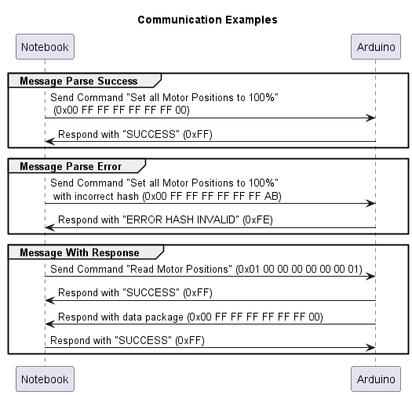

# Communication Protocol
Communication between Notebook and Arduino microcontroller is implemented using 8 byte packages. Each package consists of a command-id, up to three values (2 bytes each), and a hash-byte to verify it's integrity.

## Structure of a Package
| Byte-Index    | Description
| ------------- |:-------------:| 
| 0             |Command-Id. An overview of available commands is provided below  | 
| 1             |Most Significant Byte (MSB) of first value  | 
| 2             |Least Significant Byte (LSB) of first value  | 
| 3             |MSB of second value  | 
| 4             |LSB of second value  | 
| 5             |MSB of third value  | 
| 6             |LSB of third value  | 
| 7             |Hash-Byte to check integrity of the package. The Hash is generated by   combining the other 7 bytes using the XOR-Operator  | 

## Commands
Each package may represent either a read or a write operation. If the package contains multiple values, all of them will be read/written. The first byte of each package contains the command-id. For Write-Requests, it will be an even number. For Read-Requests, it will be an odd number.

| Command-IDs (Write / Read)   | Description
| -------------                |:-------------:| 
| 0x00 / 0x01            | Write / Read Motor Positions. Value1 = X-Axis, Value2 = Y-Axis, Value3 = Z-Axis | 
| 0x02 / 0x03             |Write / Read Homing Offsets. Value1 = X-Axis, Value2 = Y-Axis, Value3 = Z-Axis  | 
| 0x04 / 0x05             |Write / Read MAX Position. Value1 = X-Axis, Value2 = Y-Axis, Value3 = Z-Axis | 

## Communication Flow
Whenever a package is sent, a specific response is expected. There are two possible responses:
- SUCCESS (0xFF)
    - This is sent, whenever the package was received in full and the hash was determined to be valid
- INVALID HASH (0xFE)
    - This is sent, whenever the package was received in full, but the hash was not valid

